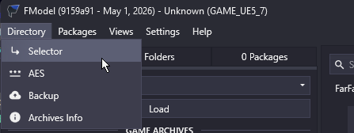
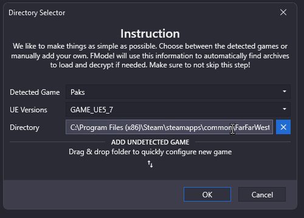
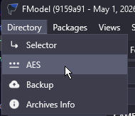
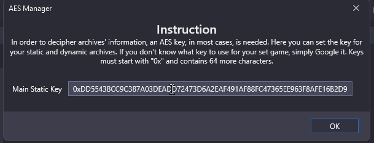
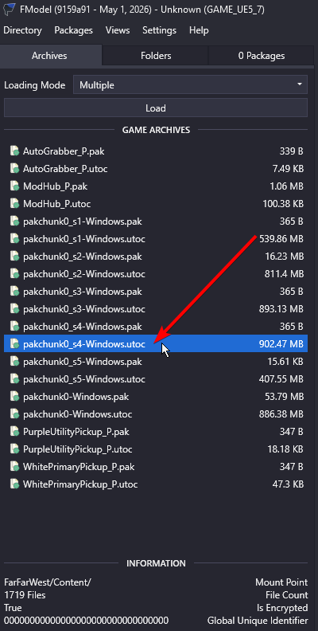
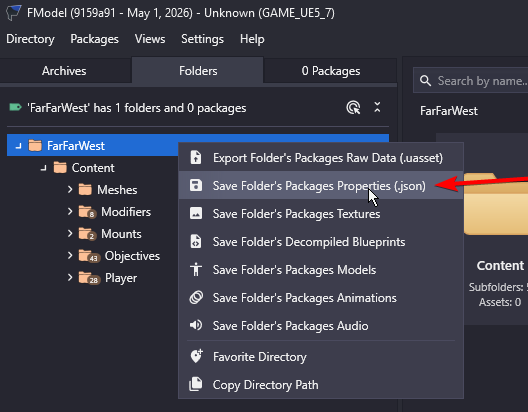
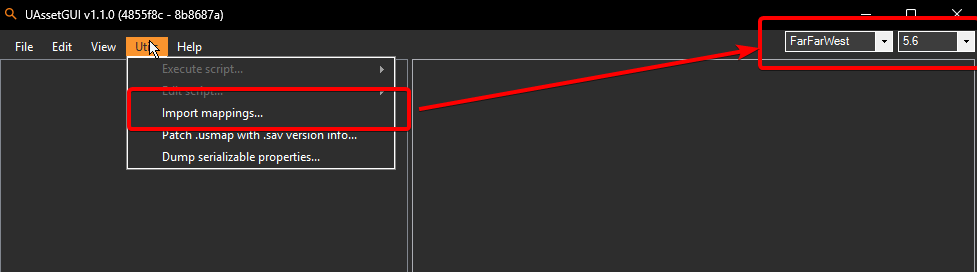

# Far Far West Modding — FModel + UAssetGUI Setup

Quick guide for new modders to get **FModel** (browse/inspect game paks) and **UAssetGUI** (edit BP assets) working with Far Far West.

> Tools live in `/tools/` of this repo. Mappings file is `tools/FarFarWest.usmap`. AES key is included below.

---

## FModel — browse the game's paks

### 1. Set the game directory

`Directory → Selector` → click the `+` (Add Undetected Game) → **UE Version: `GAME_UE5_7`** → game directory:

```
C:\Program Files (x86)\Steam\steamapps\common\FarFarWest\FarFarWest\Content\Paks
```




### 2. Configure the AES key

`Directory → AES` → paste:

```
0xDD5543BCC9C387A03DEADD72473D6A2EAF491AF88FC47365EE963F8AFE16B2D9
```

> ⚠ **Do NOT** use `Settings → Endpoint Configuration → AES`. That dialog is for HTTP-fetched rotating keys (Fortnite-style) and will throw `ArgumentOutOfRangeException`. The right path is **Directory menu → AES**.




### 3. Configure the mappings file (recommended)

`Settings → Mapping File Path` → point at `tools/FarFarWest.usmap` (or the [Drive link](https://drive.google.com/file/d/1DI9AN-zsDBlGE5IvwkH2_EC7kZxnFLhO/view?usp=sharing)). Without mappings you'll get half-readable property names.

Restart FModel after setting these.

### 4. Load + browse

- **Archives tab** lists all paks. Select all → **Load** (or `Directory → Load All Paks`).
- Use the search box to find e.g. `BP_Player` → double-click → JSON appears in the right pane.
- To export JSON for sharing: right-click asset → **Save Properties (.json)**.

✅ Done. You can now inspect any cooked asset in the game.

### 5. Bulk-export JSON for a whole pak / folder

Excellent for AI-assisted modding (feeding hundreds of asset definitions to Claude / GPT / etc. so they have the full game-state context).

1. Double-click a `.utoc` (e.g. `pakchunk0-Windows.utoc`) in the Archives list — its folder structure opens on the right.

   

2. **Right-click** any folder (or the root) → **Save Folder's Packages Properties (.json)** (sometimes shown as **Export → JSON Properties**).

   

3. Output goes to `tools/Output/Exports/FarFarWest/Content/...` mirroring the source tree. JSONs are diffable, greppable, and feed cleanly into AI tooling.

> Tip: enable **Settings → Auto Save** so every double-clicked asset auto-exports its JSON. Saves a click per asset during sustained reverse-engineering.

---

## UAssetGUI — edit cooked Blueprint assets

Use UAssetGUI when you want to **modify** a `.uasset`/`.uexp` (default values, classes, simple bytecode tweaks). For just *reading* assets, FModel is easier.

### 1. Dark mode (optional but mandatory ;)

`Edit → Settings → Theme: Dark`

### 2. Load the mappings

`Utils → Import Mappings…` → select `tools/FarFarWest.usmap` (same file FModel uses).

### 3. Engine version

Top-right corner dropdown → select **`5.6`** (UAssetGUI's `5.7` is sometimes flaky on FFW assets — `5.6` is the empirical sweet spot for this game).



### 4. Open an asset

`File → Open` → pick a `.uasset`. UAssetGUI cannot open encrypted iostore paks directly — extract first via [retoc](https://github.com/trumank/retoc/releases) (instructions below).

---

## Extracting paks to legacy format (for UAssetGUI editing)

UAssetGUI works on **legacy** uasset/uexp pairs. The game ships in **iostore** (`.utoc`/`.ucas`) format. Convert via `retoc.exe`:

```powershell
.\tools\retoc.exe `
  -a 0xDD5543BCC9C387A03DEADD72473D6A2EAF491AF88FC47365EE963F8AFE16B2D9 `
  to-legacy --version UE5_7 `
  -f BP_Player `
  "C:\Program Files (x86)\Steam\steamapps\common\FarFarWest\FarFarWest\Content\Paks" `
  ".\extracted\Base"
```

- `-f` is an asset-name filter — limits the extraction (the full game is 10+ GB).
- Output goes under `extracted/Base/FarFarWest/Content/...` mirroring the original tree.

To repack a modified asset into a `.pak`:

```powershell
.\tools\retoc.exe `
  -a 0xDD5543BCC9C387A03DEADD72473D6A2EAF491AF88FC47365EE963F8AFE16B2D9 `
  to-zen --version UE5_7 `
  ".\extracted\YourMod" `
  ".\YourMod_P.pak"
```

Drop the resulting `.pak` (+ `.ucas` + `.utoc`) into:
```
<game>\Content\Paks\Mods\
```

---

## Credits

- **FModel** — https://fmodel.app/
- **retoc** — https://github.com/trumank/retoc
- **UAssetGUI** — https://github.com/atenfyr/UAssetGUI (use the **experimental** build for newest UE versions)
- **Mappings file + AES key** — `Wr4Th_0f_D0g` (FFW modding Discord)
- **Asset-editing notes** — see `docs/asset-editing.md`

---

*Found a bug, an outdated step, or want to add an example? PRs welcome.*